# DriveTuning Detailed User Flow

This document maps out the core user journeys within the DriveTuning platform, illustrating how enthusiasts interact with their garage, the marketplace, and the community.

## 1. Core Platform Navigation
The "Carbon Glass" layout provides a persistent navigation bar allowing quick context switching.

```mermaid
graph TD
    Home["🏠 Home (Landing)"] --> Auth["🔐 Sign In / Sign Up"]
    Auth --> Garage["🏎️ My Garage (Dashboard)"]
    Garage --> Market["🛒 Marketplace"]
    Garage --> Events["📅 Events"]
    Garage --> Settings["⚙️ Settings"]
```

---

## 2. Vehicle Management & Journaling
The heart of DriveTuning is documenting the build history of a vehicle.

```mermaid
graph LR
    Garage -- "View Car" --> CarDetails["📄 Car Details"]
    CarDetails -- "+ New Entry" --> EntryForm["📝 Journal Form"]
    EntryForm -- "Save" --> LogEntry["✅ Log Created"]
    LogEntry -- "Modification Type" --> TUVBadge["🛡️ TUV Badge assigned"]
    LogEntry -- "Maintenance Type" --> ServiceHist["🛠️ Service History updated"]
```

---

## 3. The Marketplace Lifecycle
A unique flow where project history directly feeds into secondary market value.

### Selling a Part

```mermaid
graph TD
    Entry["🔧 Log Entry (Modification)"] -- "Sell as part →" --> ListingForm["📝 Create Listing Form"]
    ListingForm -- "Auto-populates" --> Details["🚗 Vehicle & Part data"]
    Details -- "Publish" --> MarketGrid["🌐 Marketplace Grid"]
```

### Buying a Part

```mermaid
graph LR
    MarketGrid -- "Click Item" --> ItemDetail["🔍 Listing Detail Page"]
    ItemDetail -- "View History" --> Provenance["📜 Part Pedigree (Original car context)"]
    ItemDetail -- "Contact" --> SellerChat["💬 Connect with Seller"]
```

---

## 4. Event Engagement
Connecting owners and their documented builds at real-world meets.

```mermaid
graph TD
    EventsPage["📅 Events Grid"] -- "Select Event" --> EventDetail["ℹ️ Event Details"]
    EventDetail -- "RSVP" --> CarSelection["🚗 Select Car from Garage"]
    CarSelection -- "Confirm" --> TheGrid["🏁 The Grid (Attendee List)"]
```

---

## 5. Account & Privacy Control
Managing how much of the build is shared with the public.

```mermaid
graph LR
    Settings["⚙️ Settings Dashboard"] --> Profile["👤 Public Profile"]
    Settings --> Privacy["🔒 Privacy Settings"]
    Privacy -- "Toggle" --> BlurPlates["☁️ Auto-blur License Plates"]
    Privacy -- "Toggle" --> HideGarage["📍 Hide Garage Location"]
```

---

> [!NOTE]
> **UX Principle**: Each step in these flows is designed with the "Carbon Glass" aesthetic, using translucent backgrounds and subtle animations to minimize friction and provide a premium feel.
